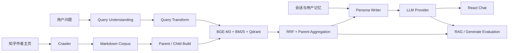

# PersonaForge

PersonaForge 是一个 local-first 的创作者数字分身平台。它从公开内容构建作者知识库，结合
混合检索、会话记忆与 Persona Writer，生成带来源、可追踪、可评估的个性化回答。

## 系统架构



## 模块详图

| 模块 | 主要内容 | 查看 |
| --- | --- | --- |
| 端到端生成链路 | React、FastAPI、Turn Planner、联网、检索、SSE 与记忆维护 | [架构图](docs/architecture/generation/generation-overview.png) |
| 四路检索链路 | Query Transform、Dense/Sparse Child 召回、两级 Parent RRF | [架构图](docs/architecture/generation/retrieval-detail.png) |
| MRPrompt 上下文 | Narrative Schema、用户记忆、会话历史与最终 messages 数组 | [架构图](docs/architecture/generation/mrprompt-context.png) |
| RAG 评估链路 | 时间切分、全量/多路候选池、双轴 Qrels 与多 K 指标 | [架构图](docs/architecture/evaluation/rag-evaluation.png) |
| Generate 评估链路 | 六维 Gold Judge、三次稳定性、机器比较与人工 AB | [架构图](docs/architecture/evaluation/generation-evaluation.png) |

三张图的 Mermaid 源码、高清 PNG、关键 JSON 输入输出和中文注释见
[生成链路架构说明](docs/architecture/generation/README.md)。完整代码索引见
[项目导航](navigation.md)。两条评估链路的指标解释见
[评估链路架构说明](docs/architecture/evaluation/README.md)。

## Docker 启动

准备 [Git](https://git-scm.com/) 和 [Docker Desktop](https://www.docker.com/products/docker-desktop/)，然后执行：

```powershell
git clone https://github.com/SlamWeb/PersonaForge-.git
cd PersonaForge-
Copy-Item .env.example .env
```

在 `.env` 中填写：

```dotenv
DEEPSEEK_API_KEY=你的_Key
```

一条命令构建并启动：

```powershell
docker compose up -d --build
```

首次构建完成后，浏览器打开：

**[http://127.0.0.1:8000/](http://127.0.0.1:8000/)**

后续启动只需 `docker compose up -d`，停止服务使用 `docker compose down`。首次进入系统会创建
管理员，随后可以在作者库输入知乎用户名或主页 URL，异步完成抓取、构建与入库。

公网共享、模型缓存、数据迁移和故障排查见 [部署文档](docs/DEPLOYMENT.md)。
