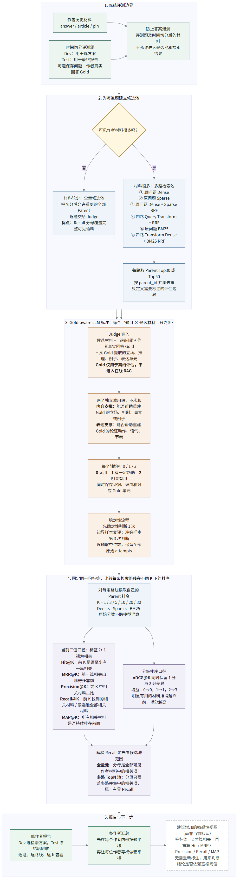
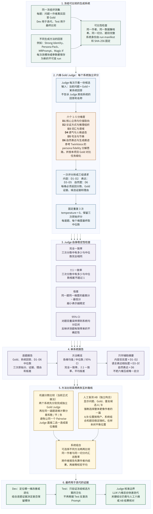

# PersonaForge 评估链路

这里用两张图说明 PersonaForge 如何评估检索质量和生成质量。图中只保留真正影响实验口径的字段；出现的变量均在下方解释。

## 1. RAG 评估链路

对应源码：[rag-evaluation.mmd](rag-evaluation.mmd)

候选池按语料规模分两种：

- 作者可见材料只有一两百篇时，直接把时间切分后允许看到的全部 Parent 作为候选池。此时 Recall 的分母覆盖完整可见语料。
- 作者材料很多时，使用六条检索路线各取 Top30 或 Top50，再按 Parent ID 合并去重。此时可以控制标注成本，但 Recall 只能解释为“多路候选并集内部的 Recall”。卢诗翰当前采用六路 Top50。

当前 Gold-aware Judge 会同时看到问题、作者真实回答 Gold 和候选材料，并分别输出两个 `0/1/2` 标签：

| 标签轴 | 判断什么 |
| --- | --- |
| `content_support` | 候选能否帮助重建 Gold 的立场、机制、事实或例子 |
| `persona_expression_support` | 候选能否帮助重建 Gold 的论证动作、语气、节奏或表达习惯 |

两个轴不加权、不相乘，也不合成总分。

### 指标怎么读

`K` 表示只观察某条检索路线最前面的 K 篇材料，例如 `MRR@3` 只看前三篇。

| 指标 | 直观含义 | 更适合回答什么问题 |
| --- | --- | --- |
| `Hit@K` | 前 K 是否至少命中一篇相关材料 | 这条路线能否快速拿到一篇可用材料？ |
| `MRR@K` | 第一篇相关材料出现得有多早 | 第一篇可用证据是否足够靠前？ |
| `Precision@K` | 前 K 中相关材料的比例 | 给 Writer 的上下文有多“干净”？ |
| `Recall@K` | 前 K 命中的相关材料 / 候选池全部相关材料 | 有用材料被找回了多少？ |
| `MAP@K` | 对每个相关命中位置计算当时的 Precision，再做平均 | 多篇有用材料是否持续靠前？ |
| `nDCG@K` | 按位置折损的分级排序质量 | 2 分材料是否比 1 分材料排得更靠前？ |

当前 Hit、MRR、Precision、Recall 和 MAP 使用 `标签 >= 1` 作为相关阈值。`nDCG` 保留完整分级，增益为 `0→0、1→1、2→3`。因此当前报告已经同时回答“有没有帮助”和“明显有用的是否排在前面”。

为了检查结论是否依赖宽松阈值，后续可以在不重新标注的情况下增加 `标签 = 2` 才算相关的严格敏感性视图。它应与当前正式口径并列展示，而不是替换历史结果。

## 2. Generate 评估链路

对应源码：[generation-evaluation.mmd](generation-evaluation.mmd)

每个生成方法先在同一冻结数据集上保存不可变回答，然后单独与作者真实回答 Gold 比较。当前六维 rubric 为：

| 维度 | 含义 |
| --- | --- |
| D1 | 核心立场与价值取向 |
| D2 | 论证方式与推理组织 |
| D3 | 词汇与语域 |
| D4 | 语气与人格姿态 |
| D5 | 句法与节奏 |
| D6 | 自然表达与生成痕迹 |

该设计参考 TwinVoice 将 persona fidelity 拆成多个能力维度的思路，再结合本项目“系统回答与作者真实回答 Gold 对比”的任务细化；不是直接复制 TwinVoice 的原始题型或分数。

每道题、每个维度固定评三次，最终取中位数。稳定性字段为：

- **完全一致率**：三次中有多少次等于中位数。
- **±1 一致率**：三次中有多少次与中位数相差不超过 1。
- **极差**：最高分减最低分，越小越稳定。
- **95% CI**：对题目重采样得到的系统均分区间，表示题目数量有限带来的不确定性；它不是“三次 Judge 分数的上下界”。

机器系统比较不再直接调用 Pairwise Judge，而是先独立完成六维评分，再按同题分差汇总胜、平、负。人工 AB 是另一条独立证据：显示 Gold 和匿名 A/B，参与者强制选择整体更像作者的一篇，位置在不同用户和题目之间稳定打散。

## 3. 代码定位

| 部分 | 主要代码 |
| --- | --- |
| 时间切分与冻结数据集 | `src/personaforge/eval/dataset.py` |
| 六路候选池与全量候选池 | `src/personaforge/eval/retrieval_pool.py` |
| Gold-aware 双轴标注 | `src/personaforge/eval/retrieval_gold_qrels.py` |
| RAG 指标 | `src/personaforge/eval/retrieval_metrics.py` |
| RAG Web 报告与多作者任务 | `src/personaforge/web/retrieval_evaluation.py`、`retrieval_eval_jobs.py` |
| 六维 Gold Judge | `src/personaforge/eval/gold_judge.py` |
| Generate 系统、人工六维、AB 与异步 Judge | `src/personaforge/web/generation_evaluation.py` |
| RAG / Generate 前端 | `web/src/EvaluationWorkspace.tsx`、`RetrievalLlmReport.tsx`、`GenerationEvaluationWorkspace.tsx` |
