# PersonaForge 在线生成链路

本文档按当前可执行代码说明一条聊天请求怎样从 React 输入框进入 FastAPI，经过多轮理解、联网补充、四路 RAG、MRPrompt 上下文组装和流式 Writer，最后成为页面上的回答。

当前方法名是 **MRPrompt**，不是 MBPrompt。冻结的单作者 Test20 结果中，`MRPrompt + RAG20` 是当前已测综合分最高的方法；这只能说明它是项目当前默认优先配置，不能表述为普遍 SOTA。

主图采用以下运行配置：

```jsonc
{
  "query_mode": "grounded",      // 启用会话理解、条件联网和多路 RAG
  "writer_prompt": "mrprompt",  // 使用 MRPrompt 与 Narrative Schema
  "parent_top_k": 20,            // 最终送给 Writer 的作者全文数量
  "trace_capture": "summary"    // 保存可观测链路摘要
}
```

只有作者存在经过证据核验的 `narrative_schema.json` 时才能运行 MRPrompt。当前前端优先选择 MRPrompt；缺少该资产时回退到 Persona Pack，仍不可用时使用 Strong Identity。

## 1. 端到端总图

这张图回答“用户按下发送后，系统依次做了什么”。关键 JSON 字段旁边都标明了它们在控制什么。



对应源码：[generation-overview.mmd](generation-overview.mmd)

## 2. 四路检索与 Parent 聚合

这张图展开总图里的 RAG 节点。当前 Grounded 链路不是把原问题直接检索一次，而是先生成四种用途不同的检索表达；每种表达分别执行 BGE-M3 Dense 和 Sparse Child 检索，再做两层 Parent RRF。



对应源码：[retrieval-detail.mmd](retrieval-detail.mmd)

关键参数：

| 参数 | 当前默认值 | 含义 |
|---|---:|---|
| `child_top_k` | 100 | 每条 Dense 或 Sparse 路线先取多少个 Child |
| `per_query_parent_k` | 30 | 每个 Query Transform 路线在第一层 RRF 后保留多少个 Parent |
| `parent_top_k` | 20 | 第二层跨路线 RRF 后进入 Writer 的 Parent 数量 |
| `rrf_k` | 60 | RRF 平滑常数，公式为 `1 / (60 + rank)` |

Parent 聚合只使用名次，不把 Dense、Sparse 的原始相似度跨模型相乘。同一篇长文在同一路线被多个 Child 命中时只贡献一次，避免长文因切片多而占便宜。

## 3. MRPrompt 上下文窗口

这张图回答“最终送给 Writer LLM 的完整信息由什么组成”。它特别区分了作者身份记忆、当前用户记忆和会话记忆，三者作用不同。



对应源码：[mrprompt-context.mmd](mrprompt-context.mmd)

最终消息结构为：

```jsonc
[
  {
    "role": "system",
    "content": "MRPrompt 系统指令 + 经过验证的 Narrative Schema"
  },
  {
    "role": "system",
    "content": "可靠性顺序 + 回答深度 + 会话摘要 + 用户记忆 + 客观背景 + Parent Top20 全文"
  },
  {
    "role": "user",
    "content": "筛选出的历史用户消息"
  },
  {
    "role": "assistant",
    "content": "筛选出的历史助手回答；只用于对话连续性"
  },
  {
    "role": "user",
    "content": "当前用户原始 query"
  }
]
```

`resolved_question` 只用于指代消解和检索，不替换最后一条用户原话。Writer 仍然直接回答用户真正输入的 query。

## 4. 条件分支与 LLM 调用次数

一次 Grounded 新问题通常包含三次主要 LLM 调用：

1. Turn Planner：理解多轮关系、补全独立问题、决定是否联网和是否检索。
2. Background + Query Transform：根据可选搜索结果生成客观背景和四路本地检索 query。
3. Writer：接收 MRPrompt 上下文并流式生成最终回答。

回答完成后，维护线程可能额外调用会话摘要、User Memory Extractor 和 User Memory Critic。这些调用不阻塞用户看到答案。

特殊分支：

- `retrieval_policy=new`：执行当前问题的新检索。
- `retrieval_policy=reuse`：只在解释上一轮回答等场景复用指定 turn 的 `parent_ids`。
- `retrieval_policy=none`：闲聊或问题不清楚时不检索；问题不清楚时只问一句澄清问题。
- `needs_web=true`：先用 Tavily 查明事件、实体或网络梗的客观含义；搜索失败会降级，不会终止本地 RAG。
- `query_mode=raw`：开发者旁路，不调用 Grounded Query Transform，只对补全后的问题做一次 Dense + Sparse 检索。

## 5. 代码定位

| 链路部分 | 主要代码 |
|---|---|
| React 请求、SSE 消费与 Trace 页面 | `web/src/App.tsx`、`web/src/api.ts` |
| FastAPI 路由、鉴权与持久化 SSE | `src/personaforge/web/app.py` |
| 后台 TurnRun、Token 落盘和异步维护 | `src/personaforge/web/chat_tasks.py` |
| 整体生成编排 | `src/personaforge/web/service.py` |
| Turn Planner、历史选择与会话摘要 | `src/personaforge/web/multiturn.py` |
| 用户长期记忆召回与更新 | `src/personaforge/web/user_memory.py` |
| 联网计划、客观背景和四路 Query Transform | `src/personaforge/ingest/query_understanding.py` |
| BGE-M3、Qdrant、Child-to-Parent 与 RRF | `src/personaforge/ingest/retrieve.py` |
| Writer message 数组与动态上下文 | `src/personaforge/persona/writer.py` |
| Narrative Schema 加载、证据核验和渲染 | `src/personaforge/persona/narrative.py` |

## 6. 图中有意省略的内容

这些图聚焦在线生成，因此只把离线资产作为侧面输入，没有展开以下流程：

- 知乎 crawler 如何生成 Markdown。
- Markdown 如何构建 Parent、Title/Lead/Passage Child。
- BGE-M3 如何批量向量化并建立每作者一个 Qdrant collection。
- Narrative Schema 如何由研究者构建和审核。
- RAG 与 Generate 评估平台如何生成指标。

它们分别属于后续的“入库链路”“RAG 评估链路”和“生成评估链路”架构图。
