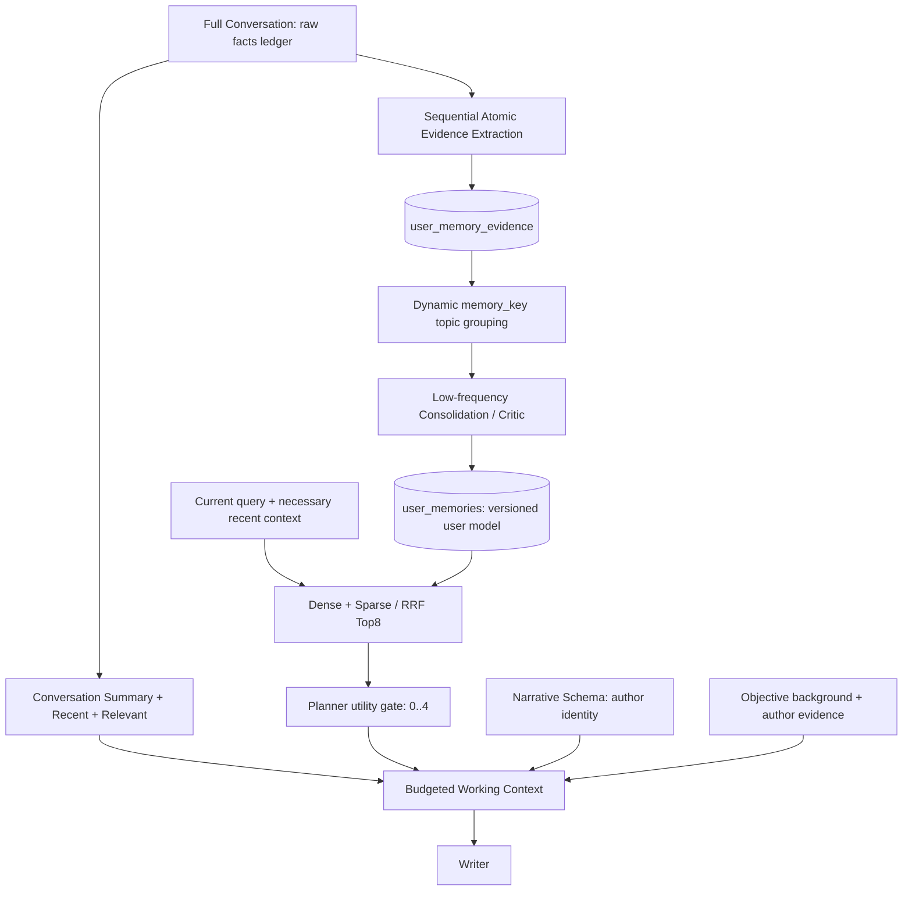

# Context / User Memory V2

## Audit baseline

Audited the local `main` at `5f8ac81` on 2026-09-19. The worktree already contained
uncommitted authentication, author-job, UI and contract changes; those were preserved.
`origin/main` was fetched and points to `e6cd9c5` (its unique commit changes README;
local main also has its own committed SSE concurrency fix). This change
does not reset, merge or publish either branch, and does not touch the deprecated workspace.

| Area | V1 implementation | V2 change |
|---|---|---|
| Full conversation | SQLite messages + turn runs, retained | Unchanged source of truth |
| Short context | Up to 6 completed turns, except `new_topic` | Preserved, subject to explicit budget guard |
| Long context | Summary + recent 3 + dense semantic old Top2 | Preserved |
| New topic | No previous history or summary | Preserved |
| Summary | Older-than-recent-three turns; separate five-field summary | Preserved compression objective |
| Recall | Raw current query → BGE-M3 dense/sparse → RRF Top8; pinned rank boost | Lightweight context for dependent follow-ups |
| Gate | Same Turn Planner call selects available IDs, max4 | Precision prompt, unique IDs, zero is valid |
| Write | Extractor → Critic → direct memory revision | Durable atoms → changed-topic consolidation |
| Checkpoint | Latest three pending turns; advance to newest sequence | Oldest complete windows, atomic evidence/checkpoint commit |
| Conflict | Critic decides extend/replace; newer evidence preferred | Explicit correction/state transition distinguished from stable preferences |
| Reliability | Post-answer worker, failures do not undo completed answer | Preserved; durable idle recovery and transaction tests added |
| Budget | Whole Writer estimate only | Component estimates, before/after and explicit omissions |

The V1 `pending_turns[-window_size:]` bug skips older backlog. `sequence` is the
user **message** sequence (usually 1,3,5...), not a contiguous turn number.
V1 already validates user-only IDs, quotes, confidence, questions and sensitive
third-party financial events. Those checks are reused, with additional guards.

## Minimal design and schema

One additive table: `user_memory_evidence`, initialized with `CREATE TABLE IF NOT
EXISTS`. Columns: `id`, `owner_id`, `topic_key`, `kind`, `content`,
`source_conversation_id`, `source_message_ids_json`, `evidence_quotes_json`,
`confidence`, `sensitivity`, `status`, `payload_json`, `memory_id`, `created_at`,
`updated_at`. An `(owner_id,status,topic_key)` index supports pending work.

`payload_json` holds the validated extraction fields, sanitized user sources,
original source timestamps, source author, and explicit remember/correction flags
needed for delayed consolidation. It never stores assistant text. Restricted
quotes are empty; sensitive financial values and credentials are redacted.
The full local conversation remains the original source. No new vector DB or dependency.

Existing `user_memories`, settings, embedding cache, revision IDs, APIs and UI stay
compatible. Evidence references memory revisions without a cascading deletion:
conversation removal must not automatically remove independently retained memory.

## Extraction, checkpoints and retry

- Every 3 new completed turns, process **oldest first** in windows. Drain all full
  windows; retain the incomplete tail. Explicit remember/correct/forget or flush
  also drains the tail. An empty, valid `candidates: []` is successful processing.
- Invalid model response or DB failure does not advance that extraction batch.
  Evidence inserts and checkpoint compare-and-swap use the same SQLite transaction.
- Deterministic evidence IDs hash owner, conversation, source IDs, key and content.
  The checkpoint CAS prevents a concurrent stale extraction from committing even
  if a nondeterministic model returns different wording on retry.
- Extraction checkpoint means **reliably examined and persisted through here**,
  not “all evidence is already a long-term memory”. Dream failure leaves pending
  evidence; retries do not call extraction again for committed turns.
- Completed turns after an earlier non-completed/retryable turn are held behind
  a sequence barrier. Retrying the earlier turn releases the full ordered prefix.
- Existing maintenance thread scans durable idle backlog every 60 seconds when
  its queue is empty; after 300 seconds idle it flushes evidence and consolidation.
  Restart does not require the lost in-memory PreparedChat. Work is bounded to 20
  conversations per scan and 24 pending atoms per topic per consolidation pass.
- Each consolidation transaction checks pending evidence and expected active
  revision IDs, then commits memory revision and evidence status together. A
  concurrent edit/forget cannot silently be overwritten by an in-flight Dream.

## Topics, triggers and conflicts

Topics remain open-ended. Extraction sees active memory topics plus pending topic
keys and is instructed to reuse semantically equivalent subjects/topics. A small
deterministic alias map normalizes `response_length` and
`user.communication.conciseness` to `user.preference.answer_length`. It deliberately
does not fuzzy-merge different family members. General semantic canonicalization
still depends on the extractor; this is not a universal ontology or similarity guarantee.

Consolidation runs on changed topics when there are three distinct source messages,
importance 5 evidence, explicit remember/correction, a changed event status, or a
planner/idle flush. No pending atoms means no consolidation call. Ordinary extraction
does not automatically rewrite every active memory.

The existing Critic becomes the Consolidator and sees atoms, sanitized user evidence,
timestamps and the active memory. It produces at most one reviewed memory per topic.
An `extend` result is a complete synthesis of still-valid old context and new evidence;
it is not appended to the old string. Provenance is unioned for compatible extensions.

- State transitions replace old active state via `supersedes_id`; old evidence remains.
- Explicit factual correction replaces the old fact.
- Stable preferences use independent evidence count, original timestamps, expression
  strength and durable intent. A local “简单说” is deterministically rejected as a
  memory atom. Replacing a stable memory additionally requires explicit correction
  or durable preference language; it is not unconditional latest-wins.
- Manual correction supersedes prior pending evidence for that topic in the same
  transaction. Forget/clear marks related evidence forgotten so delayed Dream cannot
  resurrect it. Forget is soft deletion, not physical erasure of the source conversation.

## Recall and utility gate

Recognized dependent follow-ups such as “那我现在怎么办”, “然后呢”, “这种情况下” use
current query plus the last three turns (each user excerpt ≤400 characters and
assistant context ≤200). Up to 400 summary characters are used only when recent
turns are absent. No extra LLM call. Independent queries retain raw-query recall,
preventing unrelated prior topics from polluting a new knowledge question.

Dense + Sparse, RRF Top8 and the same Planner utility gate remain. The gate prompt
requires personal facts to materially change the answer; behavioral preferences
may affect style. Pinned does not bypass the gate. IDs must exist, are deduplicated,
and are capped at 4; selecting zero is healthy. Atoms are never recalled directly.

## Writer accounting and safety

`writer_pack.details.token_budget` contains estimated before/after counts for
Narrative Schema, conversation summary, recent history, relevant old history,
user memory, objective background, author parent evidence, and total Writer input.
Total includes prompt scaffolding/current query/message framing, so the displayed
component subset need not sum exactly to total. Provider usage remains separate.

`PERSONAFORGE_WRITER_CONTEXT_BUDGET` defaults to 64000, **a configurable application
budget, not a declaration of any provider model's capacity**. Web reserves configured
output tokens and uses a 25% input estimation margin. Direct Writer calls default
to a 48000 input-only budget.

Over budget, drop full old history turns, low-priority selected memories, unprotected
summary, removable recent turns, background, then lower-ranked author evidence.
Current query, explicit constraints, identity instructions and the highest-ranked
author evidence are retained. If these alone do not fit, fail explicitly before
provider generation. No silent current-query truncation. Constraint detection uses
a small language-marker guard and is not a proof that every implicit constraint
has been recognized. Budget omissions are recorded and access counts/selected IDs
reflect memories actually injected. Original conversation and retrieved parents stay intact.

Trace shows source turn/message IDs, extracted evidence IDs, stable rejection reasons,
topic/evidence grouping, create/supersede/no-op, extend/replace mode, superseded ID,
dense/sparse ranks, gate IDs and final injected count. It does not include raw atom
sources. Trace persistence also redacts recognized credentials and third-party
financial values from strings, including full Writer capture.

## Verification and explicit limits

Tests use fresh temporary SQLite stores and deterministic fake LLM/embedding clients;
they verify executable contracts, not open-ended semantic precision. No production
data, credentials, actual corpus or model calls were needed for these tests.

| Tests | Coverage |
|---|---|
| `test_memory_v2.py` | Backlog, extraction rollback, atomic checkpoint CAS, Dream retry/rollback, topic merge, user-only sources, knowledge/question/third-party/transient rejection, correction, state transition, synthesis, forget, privacy, context recall, owner isolation |
| `test_context_budget.py` | Before/after accounting, priority trimming, current request and explicit constraint protection, gate zero/deduplicated max4 |
| `test_chat_tasks.py` additions | Maintenance failure after done, durable idle recovery, retry barrier |
| `test_trace.py` addition | Full-capture sensitive value redaction, original input unchanged |
| Existing tests | User memory, multiturn, conversations, Writer, service/Web/SSE and full repository regression |

Final verification, 2026-09-19, using
`D:\Anaconda4.7g\envs\personaforge\python.exe` with `PYTHONPATH=src`:

- Pre-change required three suites: **25 passed**.
- Final focused memory/context/conversation/Writer/maintenance/trace suites: **72 passed**.
- Final full `python -m pytest -q`: **286 passed, 3 warnings in 59.16s**.
  Warnings are Starlette/httpx and SWIG dependency deprecations.
- `git diff --check`: passed (Git emitted Windows CRLF normalization notices).
- `python scripts/check_no_secrets.py`: passed.
- No production DB migration, service restart, real LLM call, commit or push performed.

### Key diff map

| File | Change |
|---|---|
| `web/user_memory.py` | Sequential extraction, delayed consolidation, topic normalization, conflict/privacy guards, contextual recall text |
| `web/memory_evidence.py` | New evidence schema, durable inserts, checkpoint CAS, evidence suppression |
| `web/conversations.py` | Source timestamp and retryable-turn ordering barrier |
| `web/chat_tasks.py` | Idle recovery, durable gate targets, safe post-answer failures |
| `web/multiturn.py` | Precision-oriented gate, deduplicated max4 IDs |
| `persona/writer.py`, `persona/context_budget.py` | Budgeted prompt packing and component accounting |
| `web/service.py` | Contextual recall and Writer budget/trace wiring; existing unrelated config changes preserved |
| `web/trace.py` | Redaction on trace persistence |
| `web/SPEC.md`, `persona/SPEC.md`, `navigation.md`, generation docs | Updated contracts, lifecycle, scope and migration limits |

Migration keeps legacy checkpoint values. V1 has no evidence batch ledger, so it is
impossible to infer which old turns were skipped from its checkpoint alone. No
automatic replay of all historical conversations: that could restore forgotten
information. A future reviewed backfill must specify the affected conversations.

Other limits: a failed turn never retried blocks later evidence; continuous queue
load can delay idle scans; a failed topic can delay later topics until recovery;
source language/subject checks and secret redaction are intentionally conservative
heuristics, not full PII detection. A process crash after DB commit but before trace
write leaves the DB authoritative and may omit that operation from its trace.
No live-model quality/cost benchmark or production Parent Top20 token distribution
has been measured in this change; the new trace enables that measurement.

## Best three V3 directions

1. Freeze conversational recall/gate/conflict datasets and run real-model precision,
   over-personalization, latency and token-cost comparisons against V1.
2. Measure provider token usage versus component estimates; add tokenizer-aware
   budgets and evaluate evidence-preserving author context compression if needed.
3. Add reviewed legacy backfill and evidence inspection/export, with explicit
   failed-turn resolution and per-topic retry/backoff rather than more frameworks.
